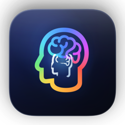

  

<h1 align="center">Habitus</h1>

  <strong>Your behavior is the signal. Not your words.</strong> 
  Behavioral intelligence for AI agents — built into your MacBook notch.

  
  
  

---

## The Problem

You configure AI agents with settings files, dotfiles, and written preferences. But **you don't actually know how you work.** Your `.editorconfig` says you prefer 4-space tabs — but do you know you always read test files before editing source? That you reorganize folders in deep nesting patterns? That you save 3x more often during debugging?

Your explicit settings capture what you _think_ you want.  
Your behavior captures what you _actually do._

## The Philosophy

Habitus is built on three principles:

### 1. Traces, not words

Every file you open, every edit you make, every folder you reorganize — your laptop traces reveal who you really are. No surveys. No config files. No onboarding wizards. Habitus reads your real workflow, silently, from the system level.

### 2. File delta is the intelligence

Your computer has thousands of files. Most are noise. What matters is **what changed, when, and how** — the incremental deltas. A file creation tells us about your organization instinct. An edit pattern reveals your iteration style. A deletion says something about your curation preference. The deltas are where behavioral signal lives.

### 3. Proactive, not reactive

Habitus doesn't wait for you to ask. It discovers your patterns and **pushes insights the moment they matter** — through native macOS notifications, right in your Dynamic Island. You never configure it. You never query it. It comes to you.

## What It Does

Habitus watches your file operations and builds a **6-dimension behavioral profile**:

| Dimension | What it measures | Example |
|-----------|-----------------|---------|
| **A — Consumption** | How you read and explore files | Sequential reader vs. breadth-first scanner |
| **B — Production** | How you create and write | Comprehensive output vs. minimal, concise |
| **C — Organization** | How you structure files | Deep nesting vs. flat structure |
| **D — Iteration** | How you edit and revise | Incremental small edits vs. full rewrites |
| **E — Curation** | How you clean up | Selective pruner vs. preserves everything |
| **F — Cross-Modal** | How you use media | Visual-heavy vs. text-only |

Each dimension is scored with a confidence percentage that increases over sessions.

## Output Formats

Your behavioral profile is automatically exported in formats that AI agents natively understand:

| Format | Agent |
|--------|-------|
| `CLAUDE.md` | Claude Code |
| `.cursorrules` | Cursor, Windsurf |
| `AGENTS.md` | Codex, Gemini CLI |
| `behavioral_profile.json` | Any custom integration |

One behavioral truth. Every agent's language.

## Dynamic Island Integration

  <em>Habitus lives in your MacBook notch.</em>

- **Collapsed** — Status dot + current phase + event count
- **Expanded** — Active agent sessions, behavioral insights, proactive suggestions
- **Notifications** — Pattern discoveries, profile updates, and suggestions pushed to you in real-time

Click the notch to expand. Click again to collapse. That's it.

## Proactive Notifications

Habitus doesn't just observe — it **acts**:

- *"You always read test files before editing source — want me to auto-open related tests?"*
- *"New pattern discovered: Incremental editing with frequent saves (91% confidence)"*
- *"CLAUDE.md auto-exported to ~/projects/ with 6 behavioral dimensions"*

Suggestions arrive as native macOS notifications. Accept, dismiss, or ignore — Habitus learns from that too.

## Privacy

- All data stays on your machine
- No cloud. No telemetry. No account required
- Behavioral profiles are stored locally in `~/.habitus/`
- No file contents are read — only metadata and structural patterns

## System Requirements

- macOS 14 Sonoma or later
- Apple Silicon or Intel (Universal Binary)
- ~12 MB download, under 50 MB RAM at runtime

## Download

**Habitus is free.**

No subscription. No account. No trial period.

[Download Habitus v0.1.0 for macOS →](https://habitus.choiszt.com/#download)

---

  <strong>Habitus</strong> — Actions speak louder than settings. 
  Built by <a href="https://github.com/choiszt">Synvo</a>

